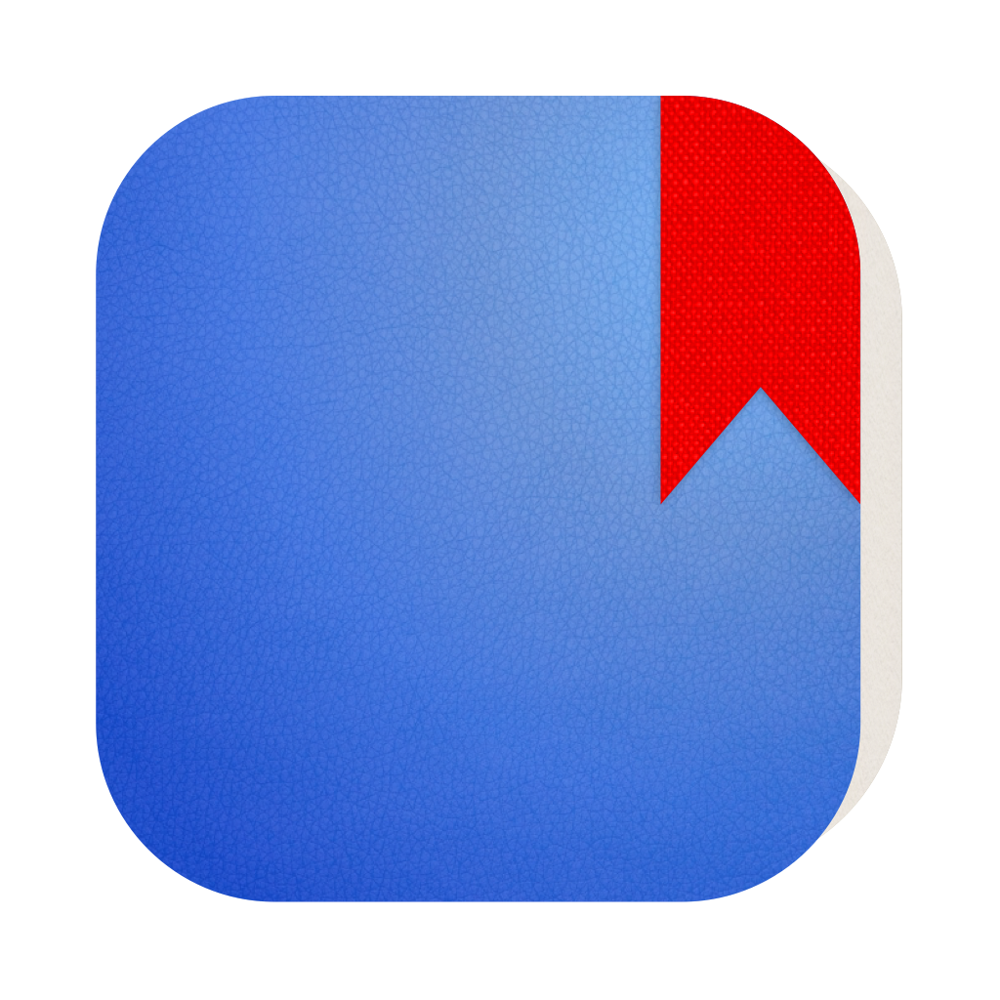
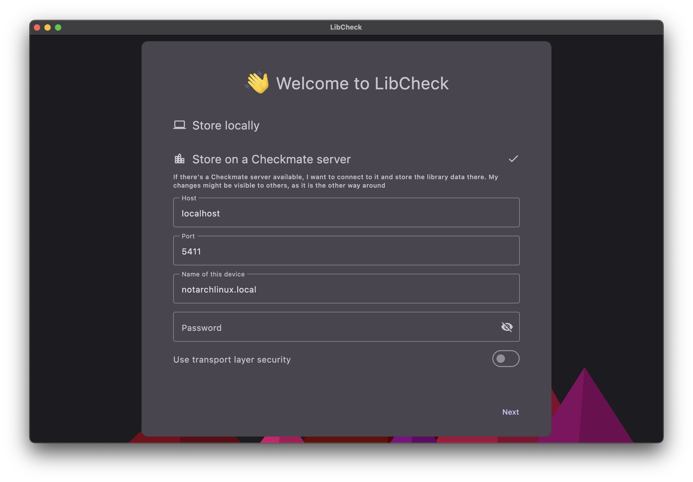
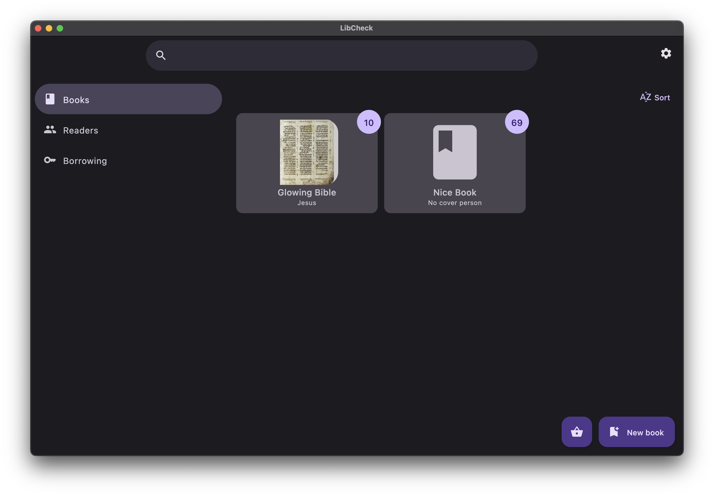
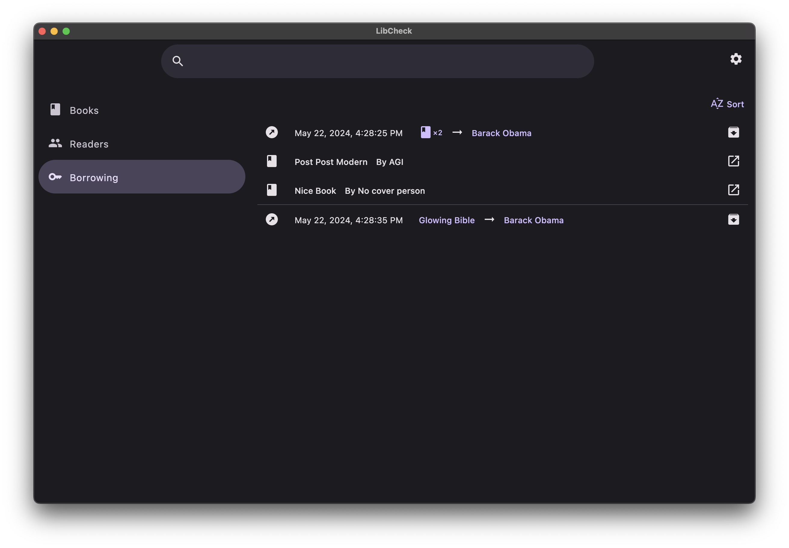

# LibCheck

<div style="display: flex">

<div style="line-height: 0.3">
    <h3>数据库课设前端：图书管理系统</h3>
    <p> Kotlin</p>
    <p> Compose Multiplatform</p>
    <a href="https://github.com/zhufucdev/libcheck/actions/workflows/package.yml"></a>
</div>
</div>

| Welcome screen |  |
|:--------------:|-----------------------------------------------------|
|  Home screen   |     |
| Borrow screen  |   |

## 编译指南

这是一个Gradle项目，你需要准备好Java 17+和一个现代操作系统

### Unix / shell

使用以下指令运行调试环境：

```shell
./gradlew run
```

打包生产环境：

```shell
./gradlew package
```

### Windows / batch

使用以下指令运行调试环境：

```shell
./gradlew.bat run
```

打包生产环境：

```shell
./gradlew.bat package
```
